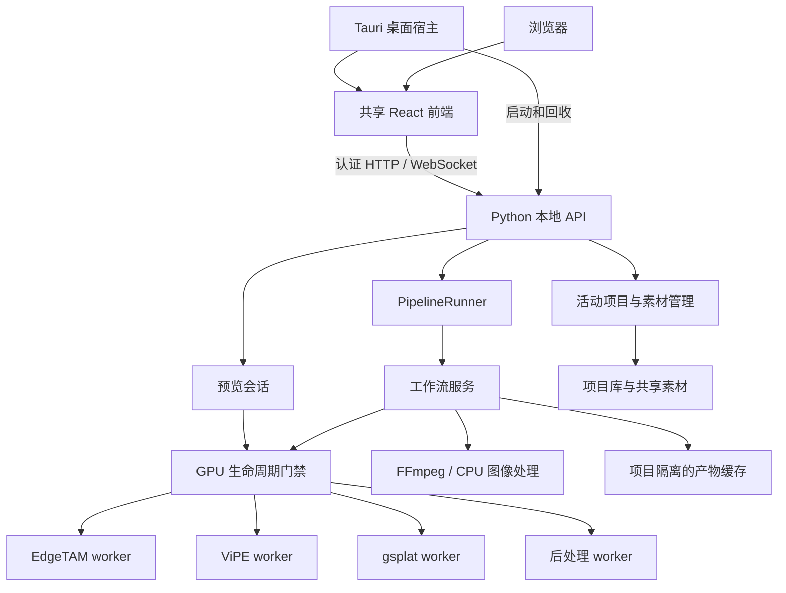
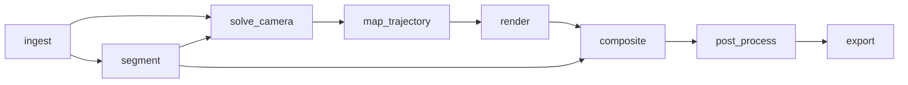

# GS Video 技术文档

本文面向需要接手开发、理解算法数据流、排查故障或维护本地运行环境的工程人员。内容以 2026-09-05 工作区源码为依据，项目版本为 `0.1.0`、项目文件 schema 为 `9`、HTTP API 版本为 `v1`。这些版本分别描述软件、持久化结构和接口命名空间，不能互相替代。

本文描述当前实现；历史设计中的设想不自动视为已交付功能。快速启动见 [README](../README.md)，术语定义见 [CONTEXT.md](../CONTEXT.md)，设计取舍见 [ADR](adr)。

## 目录

1. [产品边界与技术栈](#1-产品边界与技术栈)
2. [系统架构与进程生命周期](#2-系统架构与进程生命周期)
3. [源码导航](#3-源码导航)
4. [领域模型与持久化](#4-领域模型与持久化)
5. [工作流与缓存失效](#5-工作流与缓存失效)
6. [视频与相机几何](#6-视频与相机几何)
7. [合成色彩与后处理](#7-合成色彩与后处理)
8. [预览与前端状态](#8-预览与前端状态)
9. [API 与事件协议](#9-api-与事件协议)
10. [存储素材与缓存管理](#10-存储素材与缓存管理)
11. [运行环境与资源管理](#11-运行环境与资源管理)
12. [开发启动与验证](#12-开发启动与验证)
13. [故障定位](#13-故障定位)
14. [扩展与维护约定](#14-扩展与维护约定)

## 1. 产品边界与技术栈

GS Video 是运行在 Windows + NVIDIA GPU 上的本地视频背景替换工具。输入为源视频和静态 Gaussian Splatting PLY，输出为将原视频前景与 GS 背景合成后的 MP4。

核心方法是保留源视频中的屏幕空间人物像素，解算原视频相机运动，将相机轨迹映射到目标 GS 场景，再逐帧渲染背景。因此它不重建三维人物，不把人物放置为场景中的 Plane，也不通过人物脚点建立空间接触关系。地面、相机高度和运动尺度用于建立背景视角关系，不能据此保证人物与场景发生真实三维遮挡或接触。

当前功能包括多项目、共享素材库、人物分割、相机解算、地面对齐、固定裁剪、实时预览、抠像修边、可组合后处理和导出。色彩范围为 SDR Rec.709；效果参数对全片固定，不包含关键帧、局部调色蒙版或 HDR 工作流。

| 层次 | 当前依赖或实现 | 职责 |
| --- | --- | --- |
| Web | React 19.2.7、TypeScript 5.9.3、Vite 8.1.4 | 六步工作台、交互与 API 客户端 |
| 桌面 | Tauri 2、Rust | 本地选择/保存文件、API 进程管理 |
| API | Python 3.11、FastAPI、Pydantic 2、Uvicorn | 验证、会话、安全边界、任务调度 |
| 图像与几何 | NumPy、OpenCV、Pillow、plyfile | 数据校验、几何计算、合成和文件处理 |
| 分割 | EdgeTAM 隔离 worker | 单次人物提示与视频 Mask 传播 |
| 相机 | ViPE 隔离 worker | 完整视频的内参、位姿和深度解算 |
| GS 渲染 | gsplat / CUDA 隔离 worker | 背景帧、探索预览及拾取数据 |
| 后处理 | Torch / CUDA 隔离 worker | 校色、LUT、辉光、暗角、锐化 |
| 媒体 | FFmpeg / ffprobe | 提帧、媒体检查、预览视频和最终编码 |
| 持久化 | JSON、文件目录、内容哈希 | 项目、素材索引、不可变缓存产物 |

依赖版本以根目录 [pyproject.toml](../pyproject.toml)、[package.json](../package.json)、[Web 清单](../apps/web/package.json)及锁文件为准。表中版本是仓库声明，并非对本机已安装版本的检测报告。

## 2. 系统架构与进程生命周期



### 2.1 组合根与边界

[runtime.py](../src/gs_video/runtime.py) 的 `assemble_api_services()` 是后端生产组合根：加载存储布局，创建素材库、项目目录、worker 客户端、显存预算管理器和预览会话，再为活动项目组装 `WorkflowServices` 与 `PipelineRunner`。

业务服务依赖协议接口，例如 `CameraSolverLike`、`RendererWorkerLike`、`PostProcessBackend`，而不是在 API 路由中直接执行模型。测试可以注入替身；生产组合根明确选择实际 worker。代码中存在 NumPy 后处理参考实现，不代表生产 CUDA 失败时会自动使用它。

前端的 [composition-root.tsx](../apps/web/src/composition-root.tsx) 连接 UI、后端客户端和平台桥接。页面通过 `BackendClient` 访问业务接口，通过 `PlatformBridge` 使用平台能力，浏览器与 Tauri 的差异集中在 `platform/`。

### 2.2 桌面启动与退出

`npm run tauri:dev` 由 [run_tauri_dev.mjs](../tools/run_tauri_dev.mjs) 编排。准备脚本生成 `.runtime/desktop-runtime.json`，Vite 在 `127.0.0.1:1420` 提供界面；Rust 宿主启动 Python API，API 使用随机 loopback 端口。

会话令牌通过 stdin 传入后端，宿主完成认证健康检查后显示窗口。关闭窗口时，先请求后端停止任务与 worker，超时再回收本会话拥有的进程树。相关实现位于 [backend.rs](../apps/desktop/src-tauri/src/backend.rs)、[lifecycle.rs](../apps/desktop/src-tauri/src/lifecycle.rs)、[handshake.rs](../apps/desktop/src-tauri/src/handshake.rs) 和 [process_tree.rs](../apps/desktop/src-tauri/src/process_tree.rs)。

当前提供开发宿主，不能把 Web 构建成功等同于已生成签名安装器、自动更新包或可分发生产运行环境。

### 2.3 GPU 互斥与取消

[GpuAdmissionGate](../src/gs_video/pipeline/gpu.py) 串行化 GPU worker 生命周期，等待者会周期检查取消状态。它解决的是不同工作负载的显存争用，不是多 GPU 作业调度。

全片任务开始、页面退出或项目切换时，需要释放相应的持久预览会话。取消由 `CancellationToken` 向服务和进程客户端传播；任务状态应在清理后进入终态，不能只让前端隐藏进度条。

## 3. 源码导航

以下路径均相对于仓库根目录。

| 目录/文件 | 阅读重点 |
| --- | --- |
| `src/gs_video/app.py`、`__main__.py` | API 创建、启动握手、应用生命周期 |
| `src/gs_video/runtime.py` | 生产依赖装配和活动项目会话 |
| `src/gs_video/domain/` | 项目模型、阶段枚举、产物角色、错误类型 |
| `src/gs_video/api/` | 路由、DTO、认证、上传、任务事件和预览权限 |
| `src/gs_video/pipeline/workflow.py` | 依赖图、阶段注册和失效根 |
| `src/gs_video/pipeline/runner.py` | 递归执行、阶段认领、终态条件写入 |
| `src/gs_video/pipeline/services.py` | 八阶段实现、输入检查、缓存键及结果校验 |
| `src/gs_video/pipeline/artifacts.py` | staging 与不可变目录发布 |
| `src/gs_video/project/` | 项目目录、实例锁、素材索引、schema 迁移 |
| `src/gs_video/storage/` | 逻辑产物定位、存储迁移和缓存清理 |
| `src/gs_video/segmentation/` | 分割客户端、worker、路径和进程树保护 |
| `src/gs_video/camera/` | ViPE、相机解算结构、序列化和轨迹映射 |
| `src/gs_video/scene/` | PLY、地面拟合、GS 渲染及预览会话 |
| `src/gs_video/composite/alpha.py` | Mask 修边、边缘净化、线性光合成 |
| `src/gs_video/postprocess/` | 色彩转换、LUT、参考引擎、CUDA 引擎及协议 |
| `src/gs_video/media/` | FFmpeg 定位、导入与编码验证 |
| `src/gs_video/environment/` | 环境探针、下载修复、显存预算 |
| `apps/web/src/features/` | 各工作流页面、素材库、设置页和交互测试 |
| `apps/web/src/api/` | TypeScript DTO、HTTP 客户端和事件恢复 |
| `apps/desktop/src-tauri/` | 桌面宿主与 sidecar 生命周期测试 |
| `tools/` | 启动、环境准备、修复、测试素材和预览基准工具 |
| `tests/` | Python 单元、集成、安全和 GPU 测试 |

## 4. 领域模型与持久化

### 4.1 Project 和 WorkflowState

[models.py](../src/gs_video/domain/models.py) 是持久化模型的权威定义。`Project` 包含项目 ID、名称、创建/更新时间、素材引用、阶段状态和 `workflow`。项目通过 `source_video_asset_id`、`scene_ply_asset_id` 引用共享素材；旧的外部路径字段仅用于兼容迁移。

`WorkflowState` 保存视频/场景摘要、人物提示、探索相机、目标地面、GS 比例、场景方位角、输出裁剪、色彩解释、修边参数、效果链及其 revision、导出设置和当前产物描述。

关键约束如下：

| 字段 | 当前约束 | 工程意义 |
| --- | --- | --- |
| `gs_scale` | 0.001–1000，默认 1 | 相机高度与平移共用一个尺度 |
| `scene_azimuth` | -180°–180° | 绕目标地面法线旋转 |
| `output_crop.x/y` | -32768–32768 | 允许超出源视频范围 |
| `output_crop.width/height` | 偶数，分别 2–3840 / 2–2160 | 输出编码与画布约束 |
| `preview_height` | 180–540，默认 540 | 预览尺寸配置 |
| `effect_chain` | 最多 32 项，实例 ID 唯一 | 同类效果可重复，单个身份不能重复 |
| `effect_chain_revision` | 非负整数 | 效果链保存冲突检测 |

`ExplorationCameraPose.camera_to_world` 必须是有限的 4×4 刚体变换，旋转正交且行列式为 1。目标地面保存场景身份、提示像素、精化点、平面、相机指纹和多种 revision，避免用旧预览的拾取结果确认新地面。

### 4.2 StageState 与 ArtifactRef

`StageState` 包括 `status`、`cache_key`、`output_paths`、按角色索引的 `artifacts`、`error_code`、`input_generation` 和 `run_id`。

`ArtifactRef` 是逻辑引用，而非可任意读取的绝对路径：

```json
{
  "project_id": "00000000-0000-4000-8000-000000000001",
  "category": "post_processes",
  "cache_key": "aaaaaaaaaaaaaaaaaaaaaaaaaaaaaaaaaaaaaaaaaaaaaaaaaaaaaaaaaaaaaaaa",
  "member": null
}
```

以上仅为结构示例，不指向真实产物。`project_id` 必须是规范 UUID，`cache_key` 必须是 64 位小写十六进制字符串；`member` 若存在，必须为规范、安全的相对 POSIX 路径。项目不允许引用其他项目的缓存产物。

`ArtifactRole` 表达下游为什么需要该文件，例如 `camera_solution`、`source_depth`、`post_process_frames`；`ArtifactCategory` 表达存储分类，例如 `camera`、`post_processes`。新增文件时要分别考虑角色与分类，不能依赖 `output_paths` 的位置猜测用途。

### 4.3 文件更新、锁和 schema 迁移

[ProjectRepository](../src/gs_video/project/repository.py) 通过进程内锁串行更新项目，并采用临时文件替换保存 JSON。`ProjectInstanceLock` 使用操作系统文件锁防止同一项目被另一进程同时打开。

阶段提交以 `input_generation + status + run_id` 为条件执行 compare-and-set。假设任务 A 计算期间用户改变裁剪：相关阶段 generation 已递增，即使 A 随后完成，也不能把旧结果写回新的有效阶段状态。

项目打开时执行 `reconcile_interrupted_runs()`，修正异常退出遗留的运行中状态。它不是模型推理断点恢复；重试仍由阶段依赖和有效缓存决定从哪里开始。

[migrations.py](../src/gs_video/project/migrations.py) 逐版本迁移旧数据至 schema 9。涉及结构变化的开发必须同时考虑旧字段转换、旧产物失效和读取兼容，不能只修改 Pydantic 默认版本号。

## 5. 工作流与缓存失效

### 5.1 权威依赖图

界面六步与后端八阶段不是一一对应关系。后端真实依赖如下，既有主链，也有跨阶段依赖：



| 阶段 | 输入与处理 | 主要产物角色 |
| --- | --- | --- |
| `ingest` | 检查视频并生成源帧和代理帧 | `source_frames`、`proxy_frames` |
| `segment` | 读取人物提示，由 EdgeTAM 生成序列 Mask | `subject_masks` |
| `solve_camera` | ViPE 读取完整 RGB 视频；Mask 用于后续地面排除 | `camera_solution`、`source_depth` |
| `map_trajectory` | 将源地面基底映射到确认后的目标地面 | `mapped_trajectory` |
| `render` | 按逐帧内参与映射位姿渲染 GS 背景 | `render_frames` |
| `composite` | 放置源前景、修边并在线性光中 Alpha 合成 | `composite_frames` |
| `post_process` | 执行效果链，生成高精度帧和整片预览 | `post_process_frames`、`post_process_preview` |
| `export` | 编码、探测并验证成片 | `export_video` |

请求运行一个目标阶段时，`PipelineRunner` 递归处理依赖，复用成功阶段。上游失败时返回实际阻塞阶段，不能把尚未执行的目标阶段解释为成功。服务同时校验帧序列、文件身份和缓存内容；磁盘上存在同名目录不足以证明结果可用。

### 5.2 状态与失效范围

阶段状态为 `pending`、`running`、`succeeded`、`failed`、`cancelled`、`stale`。`stale` 表示输入已改变，旧产物可能还在磁盘，但不能作为当前有效输出。

| 修改内容 | 最早失效阶段 | 受影响的下游 |
| --- | --- | --- |
| 源视频 | `ingest` | 全部阶段 |
| 人物提示 | `segment` | 相机解算及其后续、合成及其后续 |
| 目标相机/GS 对齐 | `map_trajectory` | 渲染、合成、后处理、导出 |
| 固定输出裁剪 | `render` | 合成、后处理、导出 |
| 抠像修边 | `composite` | 后处理、导出 |
| 后处理效果链 | `post_process` | 导出 |
| 编码配置 | `export` | 无 |

失效沿 [DEPENDENCIES](../src/gs_video/pipeline/workflow.py) 传播，同时递增输入 generation，清除当前缓存键、错误及运行身份。场景素材替换还涉及目标地面和预览状态清理，需结合 API 素材绑定实现阅读。

### 5.3 缓存身份与发布

缓存键由服务针对本阶段输入、参数及相关实现身份生成。后处理缓存尤其区分像素参数与 UI 身份：实例名称、实例 ID 不应被误当成改变图像的算法参数，实际效果顺序和有效参数则影响结果。

[ArtifactPublisher](../src/gs_video/pipeline/artifacts.py) 先在受控 `.staging-*` 目录构建完整结果，检查普通文件和目录身份、执行持久化，再重命名发布到缓存键目录。已发布目录按不可变产物使用，异常时只清理归本次构建所有的 staging。

这把“文件完成”和“阶段完成”分开：前者由产物发布保证，后者由项目状态的条件写入保证。旧任务可能留下不再引用的完整缓存，但不能因此恢复已失效阶段。

## 6. 视频与相机几何

### 6.1 输入、分割与帧序列

视频素材支持 MP4、MOV、MKV；场景输入是具有 Gaussian 属性的 PLY，不能把任意普通点云当成有效 GS 场景。导入会记录大小、SHA-256、视频宽高、帧率、时长、音轨和色彩信息，场景摘要记录 Gaussian 数量及显存估算。

人物提示保存代表帧索引及源像素坐标。UI 显示图可能经过缩放和留边，点击必须经坐标换算后提交，相关实现见 [image-point.ts](../apps/web/src/features/coordinates/image-point.ts)。

阶段服务检查源帧、代理帧、Mask、相机轨迹和输出序列的对应关系。代理图用于处理或预览不能改变“同一索引对应同一时刻”的约定。帧率保留有理数表达，编码验证不能仅凭文件可播放判断正确。

### 6.2 ViPE 解算与源地面

[CameraSolution](../src/gs_video/camera/solution.py) 保存逐帧 `camera_to_world`、`frame_intrinsics`、分类、置信度、诊断和源地面估计。兼容字段 `intrinsics` 不能替代生产逐帧内参。

ViPE 接收完整 RGB 视频，人物 Mask 不覆盖其输入。Mask 在源地面拟合时排除锚帧前景，所以工作流仍依赖分割结果。地面拟合来自深度几何证据，不取人物脚底作为平面。

源地面满足 `n·X + d = 0`，其中 `n` 为单位法线。锚帧相机中心 `Cₐ` 的地面投影定义源原点：

```text
Oₛ = Cₐ - (nₛ · Cₐ + dₛ) nₛ
```

### 6.3 目标地面与轨迹映射

用户在探索视口提交三个近似提示。系统结合邻域 Gaussian 中心、深度、Opacity 和连通支持拟合平面，计算射线与平面的交点，得到精化后的 P0/P1/P2。目标地面必须经过候选生成和确认流程，并携带匹配的预览与相机 revision。

P0 是源原点在目标场景中的对应点，P0→P1 提供地面方向。探索相机用于观察和提供拟合证据，不直接成为最终合成相机。

[map_ground_aligned_trajectory()](../src/gs_video/camera/mapping.py) 用源与目标地面基底构建旋转 `A`，目标基底包含场景方位角。对每帧源旋转 `Rₜ`、相机中心 `Cₜ`：

```text
R'ₜ = A Rₜ
C'ₜ = P0 + gs_scale × A (Cₜ - Oₛ)
```

尺度只作用于相机平移，包括高度和运动幅度；旋转仍是刚体旋转，前景像素不参加这项三维变换。

### 6.4 固定输出裁剪

裁剪矩形使用源像素坐标 `(x, y, width, height)`，对全片固定。若不改变输出采样比例，将每帧内参主点平移即可直接渲染裁剪视口：

```text
cx' = cx - x
cy' = cy - y
```

缩小预览时还需按实际预览比例缩放对应内参。前景只放在裁剪矩形与源画面的交集里，交集外 Alpha 为零，背景仍由 GS 渲染填满。比如 `x=-100` 会在输出左侧新增 100 个源像素单位的背景区域，无需生成一张巨大虚拟画布。

裁剪变化只使 `render` 及其下游失效，不重跑 ViPE 和轨迹映射，也不改变对原视频相机 FOV 的解释。

## 7. 合成色彩与后处理

### 7.1 SDR 色彩边界

当前只支持 SDR Rec.709。已标记 HDR、HLG、PQ 或宽色域素材不做静默色调映射；缺少明确 Rec.709 元数据时，工作流需要记录用户选择的 `assumed_rec709` 解释。未知元数据与已知 HDR 是不同情况。

抠像修边发生在 Alpha 合成前；效果链作用于合成后的整帧 RGB；编码位于最后。这三者拥有各自参数和缓存失效根。

### 7.2 修边与高精度合成

`MatteRefinementSettings` 的参数为：

| 参数 | 默认值 | 范围与含义 |
| --- | --- | --- |
| `enabled` | true | 是否应用修边 |
| `edge_offset` | -1 | -20–20 源像素；负值收缩、正值扩张 |
| `feather_radius` | 1 | 0–20 源像素 |
| `decontaminate_strength` | 0 | 0–100，边缘颜色净化比例 |
| `decontaminate_radius` | 3 | 1–20 源像素 |

[composite_frame_16bit()](../src/gs_video/composite/alpha.py) 将前景和背景从 Rec.709 编码值转换到线性光，执行：

```text
Clinear = alpha × Flinear + (1 - alpha) × Blinear
```

结果再编码为 Rec.709 并保存为 RGB16 PNG。16 位中间帧降低反复量化误差，不意味着源视频或最终成片是 HDR。OpenCV 文件读写边界显式转换 BGR/RGB，避免通道顺序错误。

### 7.3 效果实例和参数

每个实例包括 `instance_id`、`type`、`params_version=1`、可选名称、`enabled`、`mix` 和类型对应的 `parameters`。Mix 为 0–100，使用当前实例输入与处理结果混合：

```text
output = input × (1 - mix / 100) + effect(input) × mix / 100
```

关闭或 Mix 为零的实例跳过执行。链按列表顺序处理，交换位置可能改变结果；同一种类型允许重复。

| 效果类型 | 参数范围（字段名见模型） | 算法边界 |
| --- | --- | --- |
| `primary_correction` | 曝光 -5–5；对比度/高光/阴影/色温/色调/自然饱和度 -100–100；饱和度 0–200 | 整帧基础校色，无曲线和局部蒙版 |
| `lut_3d` | `asset_id` 引用受管 LUT | 标准 3D `.cube`，四面体插值，强度统一使用 Mix |
| `bloom` | 阈值 0–200、soft knee 0–100、半径 1–256、强度 0–400、RGB tint 0–1 | 从高亮区域提取并扩散，不依赖 Mask |
| `vignette` | 强度/范围/羽化 0–100、圆度/中心偏移 -100–100 | 按输出归一化坐标形成可偏心椭圆暗角 |
| `sharpen` | 强度 0–300、半径 0.1–10、阈值 0–10 | 基于亮度的反遮罩锐化，不生成新细节 |

LUT 素材上限为 8 MiB，3D 边长为 2–65，定义域必须有限且逐通道递增。Bloom 与锐化的空间半径使用全分辨率输出像素；修边使用源像素。预览必须按相应比例换算，不能直接把缩略图半径写回项目。

效果链边界是归一化 Rec.709 RGB，内部按具体效果实现运算；不能把线性光 Alpha 合成的约定直接推广为“所有效果都在线性光中执行”。实现见 [engine.py](../src/gs_video/postprocess/engine.py) 与 [torch_engine.py](../src/gs_video/postprocess/torch_engine.py)。

### 7.4 CUDA 路径和空链

生产代表帧与整片后处理均使用 CUDA 引擎，预览采用可复用会话，整片采用独立批处理生命周期。显存不足时按引擎支持的带重叠分块方式处理；最小安全分块仍不能执行时报告可修复错误，不静默缩小分辨率或改用 CPU。具体取舍见 [ADR 0003](adr/0003-cuda-post-processing-worker.md)。

空链也必须发布 `post_process_frames` 和对应预览。这样导出只认一个权威输入，不需要维护“有后期读后期、没后期读合成”的两套路径。

### 7.5 最终编码

[media/export.py](../src/gs_video/media/export.py) 当前使用 `libx264` 或 `libx265` 软件编码器，不能因其他阶段使用 CUDA 就推断导出使用 NVENC。输出为 MP4、`yuv420p`、BT.709 元数据和有限范围；有音轨时编码为 AAC 192 kbps。

恒定质量模式将 UI 的 1–100 质量值映射到 CRF；双遍 VBR 使用 0.5–200 Mbps 目标码率。压缩预设 `fast / balanced / high_compression` 分别映射为编码器的 `fast / medium / slow`。

导出读取权威后处理帧，校验序列、宽高、帧数、帧率、时长、音轨和色彩元数据，生成摘要与校验信息。下载或复制时重新确认产物身份和项目引用，防止把过期成片当作当前结果。

## 8. 预览与前端状态

### 8.1 六步工作台

[project-store.ts](../apps/web/src/app/project-store.ts) 定义 `import → subject → camera → preview → postprocess → export`。导航根据服务端项目状态开放：场景对齐要求人物分割和相机解算成功；预览要求目标地面已确认；后期要求合成成功；导出要求后处理成功。

因此“某页面完成”不能只依据前端本地勾选。页面重新打开时，应从项目状态恢复可访问步骤。

### 8.2 三类预览

| 预览 | 作用 | 状态要求 |
| --- | --- | --- |
| GS 探索预览 | 自由浏览、获取地面提示 | 绑定场景、相机和拾取缓冲版本 |
| 合成/后处理草稿预览 | 快速观察尚未保存的参数 | 响应必须匹配本次请求和当前项目 |
| 整片后处理预览 | 播放已生成的权威处理结果 | 读取成功阶段的产物描述与二进制资源 |

探索预览的持久会话位于 [preview_session.py](../src/gs_video/scene/preview_session.py)。UI 与后端用 generation、相机 revision、预览身份等信息识别过期结果。晚到响应不能覆盖更新机位，旧拾取缓冲也不能参与当前地面确认。

草稿预览不等同于持久化保存，也不证明整片已重新生成。后处理页保存整条效果链时带 `expected_effect_chain_revision`，冲突时保留本地草稿；撤销/重做和未保存离开提示属于页面编辑状态。

### 8.3 连接与启动性能

`bootstrap` 聚合项目、素材计数、环境、显存和存储状态。存储状态与占用扫描分离：启动数据使用轻量状态，完整大小统计通过设置接口按需读取，避免递归扫描大缓存拖慢进入界面。

HTTP 客户端和事件连接负责 session token、错误解析、重连与快照恢复。平台相关的文件选择与保存通过桥接处理，不应散落为各页面自行判断 Tauri 的分支。

## 9. API 与事件协议

### 9.1 本地安全边界

API 仅允许绑定 IP loopback 地址。HTTP 受保护接口使用 `Authorization: Bearer <session-token>`，包括 `/healthz`；Origin 必须符合本次运行允许列表，不使用通配 CORS。token 不放进 URL 查询参数或项目文件。

`LocalSecurityBoundary` 检查本地连接、Origin、认证和请求体边界；`StorageMaintenanceBoundary` 协调存储维护与其他写操作。素材、缓存和导出文件检查路径穿越、重解析点、链接及文件身份；API 不是任意文件服务器。

默认请求上限来自 [ApiSettings](../src/gs_video/api/schemas.py)：JSON 64 KiB、上传分块 1 MiB、单上传 4 GiB、活动上传数 64、任务保留数 128。它们是可配置默认值，并非推荐素材规格。

### 9.2 主要接口索引

表中除 `/healthz` 外，路径统一省略 `/api/v1` 前缀。请求/响应精确定义见 `api/schemas.py`；下面列出正常业务入口，兼容别名和专门拒绝非法路径的路由不逐一列出。

| 方法 | 路径 | 用途 |
| --- | --- | --- |
| GET | `/healthz` | 认证健康检查，无版本前缀 |
| GET | `/bootstrap` | 应用初始状态 |
| POST | `/shutdown` | 请求退出 |
| POST | `/runtime/environment/refresh` | 重新执行环境探测 |
| GET / PATCH | `/runtime/storage-layout` | 存储占用/布局读取与变更 |
| POST | `/runtime/storage-layout/cache-cleanup/plan` | 生成缓存清理计划 |
| POST | `/runtime/storage-layout/cache-cleanup` | 执行匹配的计划 |
| GET / PATCH | `/runtime/vram-budget` | 读取/修改显存预算 |
| GET / POST / DELETE | `/environment/repair` | 查询/启动/取消修复 |
| GET / POST | `/projects` | 列出/创建项目 |
| POST | `/projects/{project_id}/activate` | 切换活动项目 |
| PATCH / DELETE | `/projects/{project_id}` | 重命名/删除项目 |
| GET / PATCH | `/projects/current` | 获取/修改工作流配置 |
| PATCH | `/projects/current/assets` | 绑定源视频与场景素材 |
| GET | `/assets` | 按 kind 查询素材 |
| POST | `/assets/import` | 从允许的本地文件导入 |
| DELETE | `/assets/{asset_id}` | 删除符合引用约束的素材 |
| POST | `/uploads` | 创建分块上传 |
| GET / DELETE | `/uploads/{upload_id}` | 状态/取消 |
| PUT | `/uploads/{upload_id}/chunks/{index}` | 上传指定分块 |
| POST | `/uploads/{upload_id}/complete` | 校验并接管完整素材 |
| POST | `/tasks` | 请求运行目标阶段 |
| GET / DELETE | `/tasks/{task_id}` | 查询/取消任务 |
| POST / DELETE | `/projects/current/preview/live` | 请求 GS 实时帧/释放会话 |
| POST | `/projects/current/preview/composite-draft` | 合成草稿帧 |
| POST | `/projects/current/preview/post-process-draft` | 后处理草稿帧 |
| DELETE | `/projects/current/preview/post-process-live` | 释放后处理预览会话 |
| POST | `/projects/current/preview` | 生成可用于地面提示的预览 |
| GET | `/projects/current/previews/{artifact_id}` | 获取预览图 |
| PUT | `/projects/current/target-ground/candidate` | 根据提示拟合候选地面 |
| POST | `/projects/current/target-ground/confirm` | 确认候选 |
| GET | `/projects/current/subject-media/{role}` | 获取人物步骤媒体描述 |
| GET | `/projects/current/subject-media/{role}/{artifact_id}` | 获取对应媒体内容 |
| GET | `/projects/current/post-process-preview` | 获取整片预览描述 |
| GET | `/artifacts/post-process-previews/{artifact_id}` | 获取预览视频 |
| GET | `/projects/current/export` | 获取经过验证的导出描述 |
| GET | `/projects/current/exports/{artifact_id}` | 获取成片 |
| POST | `/projects/current/exports/{artifact_id}/copy` | 复制成片到允许的目标位置 |
| WebSocket | `/events` | 任务事件与断线恢复 |

`current` 指服务端当前活动项目。异步编辑应使用接口支持的 `expected_project_id` 等身份条件，防止切换项目后迟到的请求误修改其他项目。

### 9.3 效果链保存示例

向 `PATCH /api/v1/projects/current` 提交以下结构，可在预期 revision 为 0 时保存一项锐化效果。示例 ID 必须替换为当前项目与实际实例 ID；接口返回新的项目状态作为保存结果。

```json
{
  "expected_project_id": "00000000-0000-4000-8000-000000000001",
  "expected_effect_chain_revision": 0,
  "effect_chain": [
    {
      "instance_id": "00000000-0000-4000-8000-000000000002",
      "type": "sharpen",
      "params_version": 1,
      "enabled": true,
      "mix": 50.0,
      "parameters": {"amount": 50.0, "radius": 1.0, "threshold": 1.0}
    }
  ]
}
```

`effect_chain` 与 `expected_effect_chain_revision` 必须同时提供。冲突时先读取最新项目并让编辑流程处理差异，不能无条件覆写本地草稿或反复提交旧 revision。

### 9.4 WebSocket 握手与恢复

连接 `ws://127.0.0.1:<port>/api/v1/events` 后，按顺序交换：

```text
客户端 → {"type":"authenticate","token":"<session-token>"}
服务端 → {"type":"authenticated","revision":<当前版本>}
客户端 → {"type":"resume","after_revision":<最后处理的版本>}
服务端 → task_event 或 resync_required
```

认证和 resume 各有默认 3 秒超时。事件包含任务 ID、阶段、revision、progress、错误及进度详情；详情包括 current/total、message、elapsed_seconds、eta_seconds。默认事件窗口为 256，落后过多、窗口溢出等情况需要重新同步快照。

事件窗口和任务快照在进程内维护，不是持久消息队列。API 重启后恢复应以项目状态为基础，不能假设旧任务 ID 或旧 revision 仍存在。当前 `TaskService` 实际使用单线程执行器串行运行流水线任务，不能根据配置中 `task_workers` 字段推断任务已并行化。

### 9.5 错误模型

错误统一使用 `code`、`category`、`message`、`retryable`。客户端应以 code 和 retryable 决策，而不是匹配本地化 message。验证失败、资源不足、过期预览、项目切换冲突与环境缺失需要分别处理；一次 HTTP 409 不能直接归因为网络故障。

## 10. 存储素材与缓存管理

默认数据容器为 `.runtime/data`；存储布局初始化后的主要结构如下，迁移配置可改变项目库和缓存根目录：

```text
.runtime/
  desktop-runtime.json
  user-settings.json
  data/
    project-library/
      .gs-video-storage.json
      catalog.json
      assets/
        index.json
        video/、ply/、lut/ ...
      projects/<project_id>/
        project.json
        .gs-video.lock
    cache-library/
      .gs-video-storage.json
      projects/<project_id>/<category>/<cache_key>/...
    logs/
```

此图展示业务主干，不是 `.runtime` 的完整清单；其中还包含各 worker、模型、媒体工具和构建资源。

### 10.1 素材归属

素材导入后由应用接管，项目使用素材 ID 引用，不继续依赖原来的外部文件路径。素材库维护独立索引和内容身份，允许多个项目复用同一素材。删除项目不等于删除共享原始素材，素材删除必须检查引用关系，包括效果链中的 LUT。

浏览器通过分块上传接入文件，前端提供增量 SHA-256 和上传恢复逻辑；服务端完成后进行整体验证再接管。恢复信息不是 session token 的持久存储位置。

### 10.2 存储迁移

项目库和缓存必须是本地固定磁盘上的不重叠目录。根目录由 `.gs-video-storage.json` 标识身份，路径相同并不足以证明磁盘或目录未被替换。

项目库支持迁移或选择符合约束的已有项目库；缓存支持迁移或使用新缓存。迁移执行文件清单、大小与哈希核对，并记录 staging/操作状态。配置切换后要求重启，以重新建立活动项目和 worker 路径。

不能把迁移过程理解成“复制后立即删除旧根目录”：旧位置的后续处置应依据实际迁移结果和数据保留需求单独进行。

### 10.3 缓存清理

`safe` 清理未引用缓存；`deep` 先清除项目中的相关产物有效状态，再清理更广范围的缓存。深度清理也会清除预览、导出结果和目标地面状态，用户后续可能需要重新确认对齐。

清理采用两步协议：先生成计划，再提交 `plan_token`。计划默认有效 300 秒，绑定模式、目录身份、引用集合和库存指纹；期间内容变化会使计划失效。不能缓存一个 token 在未来重复使用。

备份至少包含整个项目库及所需本机配置；需要保留的最终成片应另存。缓存通常可重建，但重建依赖源素材和可用模型环境，计算成本也可能很高。

## 11. 运行环境与资源管理

### 11.1 主环境与 worker 环境

主 `.venv` 运行 API 和编排逻辑，模型 worker 使用隔离环境。后处理复用渲染环境的 Python 启动前缀，但运行独立的后处理 worker 协议，不能据此把它当成 GS 渲染的一部分。

[WorkflowRuntimeConfig](../src/gs_video/runtime.py) 检查绝对路径、worker 参数和资源位置；桌面准备脚本允许暂缺模型资源，以便进入 UI 修复。此模式允许启动不代表相应阶段已可执行。

### 11.2 环境修复

[runtime-manifest.json](../tools/runtime-manifest.json) 固定资源下载信息；`environment/manifest.py`、`download.py`、`repair.py` 分别负责清单、下载验证和修复编排。下载使用 HTTPS、预期大小和 SHA-256 校验，并通过 `.partial` 支持恢复。

修复任务在独立进程运行，提供进度、取消和重试。完成后重新运行环境探针，必要时要求重启。修复范围是应用受管资源，不安装系统 Python、Node、Rust、NVIDIA 驱动或系统 CUDA Toolkit，也不修改系统 PATH。

### 11.3 显存与磁盘准入

显存支持标准和自定义预算，标准值为 8192 MiB，自定义最小值 1024 MiB，并结合实际探测限制使用。设置改变要与运行中任务和预览生命周期协调。

[resource_admission.py](../src/gs_video/resource_admission.py) 对 GS 场景估算额外帧缓冲，并要求估算值不超过预算的 80%；磁盘阶段估算增加 20% 余量。它们是启发式准入检查，不能保证实际峰值永远不超限，也不能当作性能基准或精确容量规划。

高分辨率长视频的源帧、渲染帧和两套 RGB16 帧序列可能占用大量空间。评估资源时需要同时考虑帧数、输出尺寸、Gaussian 数量、效果空间半径和编码临时文件。

## 12. 开发启动与验证

### 12.1 前置条件和安装

主要目标环境为 Windows 11 x64、可用 NVIDIA 驱动及 CUDA GPU。根清单要求 Python `>=3.11,<3.12`、Node `>=24.14.0,<25`、npm `>=11.12.1,<12`。桌面构建另需 Rust `>=1.77.2` 及 Windows C++/WebView2 工具链。

以下是仓库提供的开发命令，均在仓库根目录 PowerShell 执行；本文编写过程未执行安装或启动：

```powershell
py -3.11 -m venv .venv
.venv\Scripts\python.exe -m pip install -e ".[dev]"
npm ci
npm run tauri:dev
```

浏览器模式分别在两个终端执行：

```powershell
npm run api:dev
```

```powershell
npm run dev:web
```

打开 `http://127.0.0.1:1420`，输入 API 终端输出的随机端口和 session token。API 端口不是固定的 1420；1420 是 Web 开发服务器端口。

### 12.2 自动化检查

```powershell
npm run typecheck:web
npm run test:web -- --run
npm run build:web
.venv\Scripts\python.exe -m pytest -m "not gpu"
.venv\Scripts\python.exe -m ruff check src tests tools
.venv\Scripts\python.exe -m mypy
git diff --check
```

Rust 测试针对 `apps/desktop/src-tauri/Cargo.toml`。直接运行 Cargo 前应配置实际使用的 `RUSTUP_HOME`、`CARGO_HOME`、`CARGO_TARGET_DIR`；桌面启动脚本包含对工程内 `.runtime/cargo/bin/cargo.exe` 的发现逻辑。

### 12.3 测试分层与验收边界

| 测试区域 | 主要验证内容 |
| --- | --- |
| `tests/unit/domain`、`project`、`storage` | 模型限制、迁移、锁、产物归属、存储安全 |
| `tests/unit/pipeline` | 状态机、条件提交、服务与产物发布 |
| `tests/unit/camera`、`scene` | 相机几何、轨迹映射、地面拟合、worker 协议 |
| `tests/unit/postprocess`、`composite` | 色彩数学、LUT、Mask 修边与 worker 会话 |
| `tests/integration/api`、`pipeline` | API 装配、任务、项目切换与失效传播 |
| `tests/integration/media` | 实际媒体导入、FFmpeg 导出行为 |
| `tests/security/test_local_api.py` | 本地 API 安全边界 |
| `apps/web/src/**/*.test.ts(x)` | 客户端契约、页面导航与交互回归 |
| `apps/desktop/src-tauri/tests/sidecar_lifecycle.rs` | sidecar 启停与宿主生命周期 |
| 带 `gpu` 标记的测试 | 配置真实 NVIDIA/model 环境后的硬件路径 |

“非 GPU”不等于所有测试都完全没有外部资源需求。FFmpeg、测试素材或隔离 worker 仍可能需要准备。测试素材信息见 [tests/assets/NOTICE.md](../tests/assets/NOTICE.md) 与 [媒体 fixture 说明](../tests/fixtures/media/README.md)。

真实端到端验收应完成：导入短片与有效 GS → 提示人物 → 相机解算 → 目标地面候选及确认 → 超出源范围的裁剪 → 修边 → 空链与非空链预览 → 最终导出 → 核查帧数、音画时长和色彩。另需检查取消、项目切换、应用关闭后的 GPU 释放和过期响应隔离。

单元测试通过不能证明 CUDA 像素正确、桌面拖动手感正常或导出已在目标播放器验证。验证报告应分别写明静态检查、模拟协议测试、真实媒体处理和 GPU/UI 人工验收的实际执行情况。

## 13. 故障定位

默认 worker 日志位于 `.runtime/data/logs`，生产装配中包括 `segmentation-worker.log`、`vipe-worker.log`、`renderer-worker.log`、`preview-session-worker.log`。其他错误结合 API 开发终端、任务错误对象和修复状态查看；session token 不应复制到问题报告中。

| 现象 | 首先检查 | 相关实现 |
| --- | --- | --- |
| UI 无法连接 API | 随机 API 端口、token、Origin、认证健康检查 | `app.py`、`api/auth.py`、`api/middleware.py` |
| 可打开 UI，但模型任务失败 | 环境探针、缺失资源、worker 启动路径 | `environment/doctor.py`、`runtime.py` |
| 修复反复失败 | 资源 ID、下载大小/哈希、partial 与磁盘空间 | `environment/download.py`、`repair.py` |
| 相机解算或源地面失败 | ViPE 日志、深度/帧数、源地面几何审计 | `camera/vipe_worker.py`、`vipe_solver.py` |
| 地面确认被拒绝 | 场景/相机/拾取 revision、提示支持和候选状态 | `scene/ground_fit.py`、`api/routes.py` |
| 拖动后预览跳回旧画面 | 请求 generation、迟到响应、相机版本 | `preview_session.py`、前端相机页面 |
| 预览接口返回 409 | 当前项目、阶段是否 stale、产物身份是否改变 | `api/preview_routes.py`、`draft_preview.py` |
| 显存不足或任务等待 | 预算、场景大小、预览会话是否释放 | `pipeline/gpu.py`、`environment/vram.py` |
| 效果保存冲突 | 最新 `effect_chain_revision` 与本地草稿 | `api/routes.py`、`postprocess-page.tsx` |
| 导出无法通过验证 | 帧序列、偶数尺寸、FFmpeg、音轨与 BT.709 | `media/export.py`、`api/export_routes.py` |
| 清理计划失效 | 是否超时、文件或引用是否改变 | `storage/layout.py` |
| 项目提示被占用 | 是否确有另一实例持有 OS 文件锁 | `project/repository.py` |

排查顺序应从任务错误码和当前项目状态开始，再进入对应日志与产物。不要先删除整个 `.runtime`，其中同时包含运行环境、持久素材、项目和可重建缓存。

## 14. 扩展与维护约定

### 14.1 新增后处理效果

1. 在领域模型增加类型与参数校验，明确参数版本、单位、默认值及 Mix 语义。
2. 扩展参考引擎和 CUDA 引擎，保持代表帧、整片和分块处理的数学一致性。
3. 更新 worker 协议、像素缓存身份、TypeScript DTO 和效果编辑器。
4. 覆盖关闭、Mix=0/100、重复实例、重排、低分辨率预览及分块边界；需要硬件结论时执行真实 CUDA 验证。
5. 更新术语、ADR 和本文。修改现有效果数学时同步考虑缓存版本，避免复用旧像素。

### 14.2 新增阶段或更改产物

必须联合检查 `StageName`、`DEPENDENCIES`、`INVALIDATION_ROOT`、工作流注册、产物角色/分类、存储解析、迁移、前端导航、资源估算和测试 fixture。增加一个阶段不只是增加服务类。

保持阶段结果通过 `StageResult` 和逻辑产物引用交付，通过发布器写缓存，再通过仓库条件写入提交权威状态。不要在 UI 或路由中直接拼接缓存绝对路径。

### 14.3 修改相机或预览

保持逐帧内参与源像素坐标一致，明确矩阵方向是 camera-to-world 还是 world-to-camera。地面拟合、相机修订、预览 generation、拾取缓冲和项目身份必须成套更新。

新的编辑能力应先明确改变哪一类输入、从哪个阶段失效，以及未保存草稿是否允许预览。真实拖动、快速切换、取消和迟到响应等问题应通过对应交互测试重现，而不是只验证字段赋值。

### 14.4 文档同步

依赖版本从清单读取，启动方式从工具脚本读取，工作流从依赖图读取，接口从路由与 DTO 读取。历史 specs 用于解释设计背景；当它与当前源码不一致时，先区分迁移兼容、尚未实现或设计已经变更，再更新面向开发者的说明。
